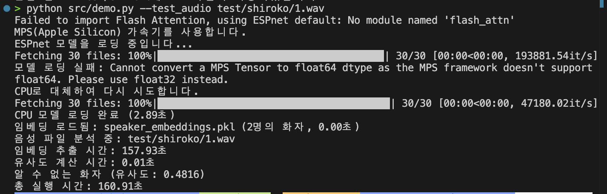

# ESPnet 기반 화자 인식 시스템 PoC

이 프로젝트는 ESPnet을 사용하여 구현된 간단한 화자 인식 시스템의 Proof of Concept입니다.

해당 프로젝트에 사용된 데이터는 비 상업적이며, 학습적 목적을 위해 가공되었습니다.

```
@inproceedings{watanabe2018espnet,
  author={Shinji Watanabe and Takaaki Hori and Shigeki Karita and Tomoki Hayashi and Jiro Nishitoba and Yuya Unno and Nelson {Enrique Yalta Soplin} and Jahn Heymann and Matthew Wiesner and Nanxin Chen and Adithya Renduchintala and Tsubasa Ochiai},
  title={{ESPnet}: End-to-End Speech Processing Toolkit},
  year={2018},
  booktitle={Proceedings of Interspeech},
  pages={2207--2211},
  doi={10.21437/Interspeech.2018-1456},
  url={http://dx.doi.org/10.21437/Interspeech.2018-1456}
}
@inproceedings{hayashi2020espnet,
  title={{Espnet-TTS}: Unified, reproducible, and integratable open source end-to-end text-to-speech toolkit},
  author={Hayashi, Tomoki and Yamamoto, Ryuichi and Inoue, Katsuki and Yoshimura, Takenori and Watanabe, Shinji and Toda, Tomoki and Takeda, Kazuya and Zhang, Yu and Tan, Xu},
  booktitle={Proceedings of IEEE International Conference on Acoustics, Speech and Signal Processing (ICASSP)},
  pages={7654--7658},
  year={2020},
  organization={IEEE}
}
```

## 설치 방법

0. python 3.10 준비

```
pyenv install 3.10
```

1. 필요한 패키지 설치:

```bash
uv venv
source .venv/bin/activate
uv sync
```

## 사용 방법

### 로컬 화자 인식 데모

```
# 모든 화자 음성 파일 등록
python src/demo.py --register_dir data
```


```
# 화자 식별 테스트
# 학습에 사용하지 않은 미카 목소리를 테스팅합니다.
python src/demo.py --test_audio test/mika/1.wav

# 학습에 사용하지 않은 카즈사 목소리를 테스팅합니다.
python src/demo.py --test_audio test/kazusa/1.wav
```


```
# 화자 학습을 하지 않은 데이터, 시로코 목소리를 테스팅합니다.
python src/demo.py --test_audio test/shiroko/1.wav
```



### 실시간 화자 인식

```bash
# 실시간 화자 인식 모드 실행 (로컬)
python src/realtime_speaker_recognition.py
```

### 서버-클라이언트 구조로 화자 인식 실행

메타버스 환경에 적용하기 위한 서버-클라이언트 구조로도 실행 가능합니다.

1. 서버 실행:
```bash
# 기본 설정으로 서버 실행
python run_server.py

# 고급 옵션 사용
python run_server.py --host 0.0.0.0 --port 8000 --embeddings speaker_embeddings.pkl --api-key your_api_key
```

2. 클라이언트 실행:
```bash
# 기본 설정으로 클라이언트 실행
python run_client.py

# 고급 옵션 사용
python run_client.py --server http://localhost:8000 --api-key your_api_key --duration 5 --threshold 0.7 --local-fallback
```

#### 서버 API 엔드포인트

서버는 다음과 같은 REST API 엔드포인트를 제공합니다:

- `GET /health` - 서버 상태 확인
- `POST /speakers/register` - 화자 등록
- `POST /speakers/identify` - 화자 식별
- `GET /speakers/{speaker_id}` - 화자 정보 조회
- `GET /speakers` - 화자 목록 조회
- `DELETE /speakers/{speaker_id}` - 화자 삭제
- `POST /batch` - 배치 작업 처리

## 디렉토리 구조

```
.
├── assets/                   # 이미지 파일 저장
│   ├── embedding.png         # 임베딩 관련 이미지
│   └── test.png              # 테스트 결과 이미지
├── data/                     # 화자 데이터
│   ├── kazusa/               # 카즈사 음성 학습 데이터
│   └── mika/                 # 미카 음성 학습 데이터
├── src/
│   ├── speaker_recognition.py       # 화자 인식 핵심 로직
│   ├── demo.py                      # 데모 스크립트
│   ├── realtime_speaker_recognition.py # 실시간 화자 인식
│   ├── server_api.py                # 서버 API 클라이언트
│   └── speaker_server.py            # 화자 인식 서버 구현
├── test/                     # 테스트 데이터
│   ├── kazusa/               # 카즈사 음성 테스트 데이터
│   ├── mika/                 # 미카 음성 테스트 데이터
│   └── shiroko/              # 시로코 음성 테스트 데이터 (학습하지 않은 데이터)
├── pyproject.toml            # 프로젝트 의존성 정의
├── convert_to_wav.py         # 영상을 WAV로 변환
├── run_server.py             # 서버 실행 스크립트
├── run_client.py             # 클라이언트 실행 스크립트
└── speaker_embeddings.pkl    # 저장된 화자 임베딩
```

## 참고사항

- 입력 오디오는 WAV 형식을 권장합니다.
- convert_to_wav.py를 사용하여 영상을 음성 데이터로 변환합니다.
- 샘플링 레이트는 자동으로 모노 16kHz로 변환됩니다.
- 화자 식별 시 기본 유사도 임계값은 0.7입니다.
- 서버 API를 사용할 때는 적절한 API 키를 설정해야 합니다.

### uv sync시 portaudio 이슈

```
macOS - brew install portaudio
or
debian - apt-get install portaudio19-dev python-all-dev
```

## 메타버스 환경에서의 응용

- **익명 화자 인식**: 메타버스 환경에서 사용자의 신원을 노출하지 않으면서도 동일인 여부를 식별
- **불건전 행위 추적**: 언어적 폭력이나 불건전 행위를 한 사용자를 익명으로 식별하고 추적
- **맞춤형 경험 제공**: 이전 만남 기록을 바탕으로 사용자 경험 개선
- **보안 강화**: 음성 기반 사용자 인증을 통한 보안 강화

## TODO

- 같은 성우, 다른 캐릭터도 인식하는지 (동일인 확인 가능한지)
- 화자 인식 임베딩의 최소 길이는? / 화자 인식 비교를 위한 데이터 최소 길이는?
- 실시간성 대응 가능한지 확인
- 메타버스 내에서 응용 가능 시나리오 확립
  - dislike 받은 유저의 목소리를 1 min 저장. embedding 해놨다가, 추후 실시간으로 매칭.
- 서버-클라이언트 구조에서 성능 최적화
  - 서버 처리 성능 향상을 위한 배치 처리
  - 경량화된 클라이언트 모델 개발
