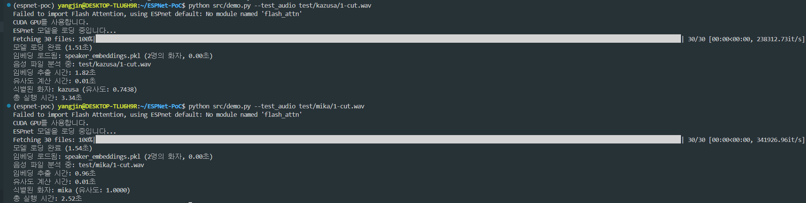

# ESPnet 기반 화자 인식 시스템 PoC

이 프로젝트는 ESPnet을 사용하여 구현된 간단한 화자 인식 시스템의 Proof of Concept입니다.

```
@inproceedings{watanabe2018espnet,
  author={Shinji Watanabe and Takaaki Hori and Shigeki Karita and Tomoki Hayashi and Jiro Nishitoba and Yuya Unno and Nelson {Enrique Yalta Soplin} and Jahn Heymann and Matthew Wiesner and Nanxin Chen and Adithya Renduchintala and Tsubasa Ochiai},
  title={{ESPnet}: End-to-End Speech Processing Toolkit},
  year={2018},
  booktitle={Proceedings of Interspeech},
  pages={2207--2211},
  doi={10.21437/Interspeech.2018-1456},
  url={http://dx.doi.org/10.21437/Interspeech.2018-1456}
}
@inproceedings{hayashi2020espnet,
  title={{Espnet-TTS}: Unified, reproducible, and integratable open source end-to-end text-to-speech toolkit},
  author={Hayashi, Tomoki and Yamamoto, Ryuichi and Inoue, Katsuki and Yoshimura, Takenori and Watanabe, Shinji and Toda, Tomoki and Takeda, Kazuya and Zhang, Yu and Tan, Xu},
  booktitle={Proceedings of IEEE International Conference on Acoustics, Speech and Signal Processing (ICASSP)},
  pages={7654--7658},
  year={2020},
  organization={IEEE}
}
```

## 설치 방법

0. python 3.10 준비

```
pyenv install 3.10
```

1. 필요한 패키지 설치:

```bash
uv venv
source .venv/bin/activate
uv sync
```

## 사용 방법

```
# 모든 화자 음성 파일 등록
python src/demo.py --register_dir data
```


```
# 화자 식별 테스트
# 학습에 사용하지 않은 미카 목소리를 테스팅합니다.
python src/demo.py --test_audio test/mika/1.wav

# 학습에 사용하지 않은 카즈사 목소리를 테스팅합니다.
python src/demo.py --test_audio test/kazusa/1.wav

```



## 디렉토리 구조

```
.
├── data/
│   ├── speaker_embeddings/    # 저장된 화자 임베딩
│   └── audio_samples/         # 테스트용 오디오 샘플
├── src/
│   ├── speaker_recognition.py # 화자 인식 핵심 로직
│   └── demo.py               # 데모 스크립트
└── requirements.txt          # 필요한 패키지 목록
```

## 참고사항

- 입력 오디오는 WAV 형식을 권장합니다.
- convert_to_wav.py를 사용하여 영상을 음성 데이터로 변환합니다.
- 샘플링 레이트는 자동으로 모노 16kHz로 변환됩니다.

- 화자 식별 시 기본 유사도 임계값은 0.7입니다.

### uv sync시 portaudio 이슈

```
macOS - brew install portaudio
or
debian - apt-get install portaudio19-dev python-all-dev
```
